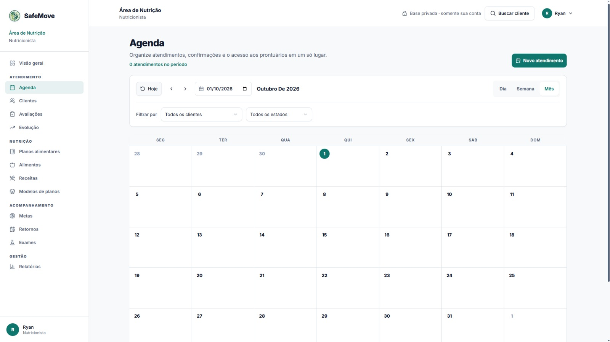
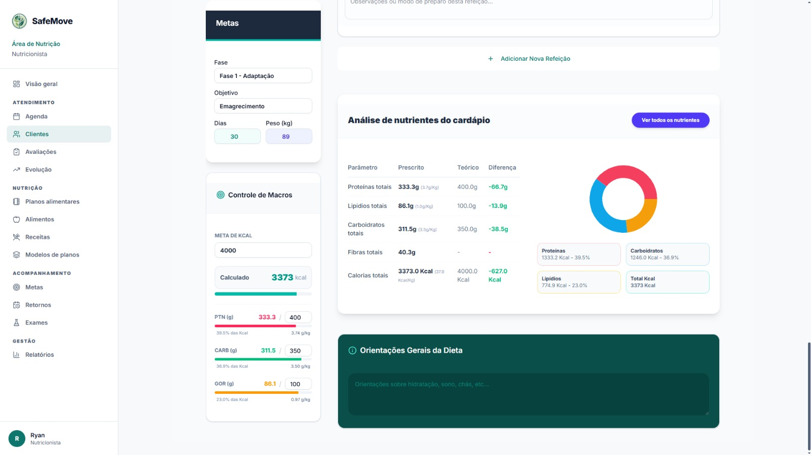
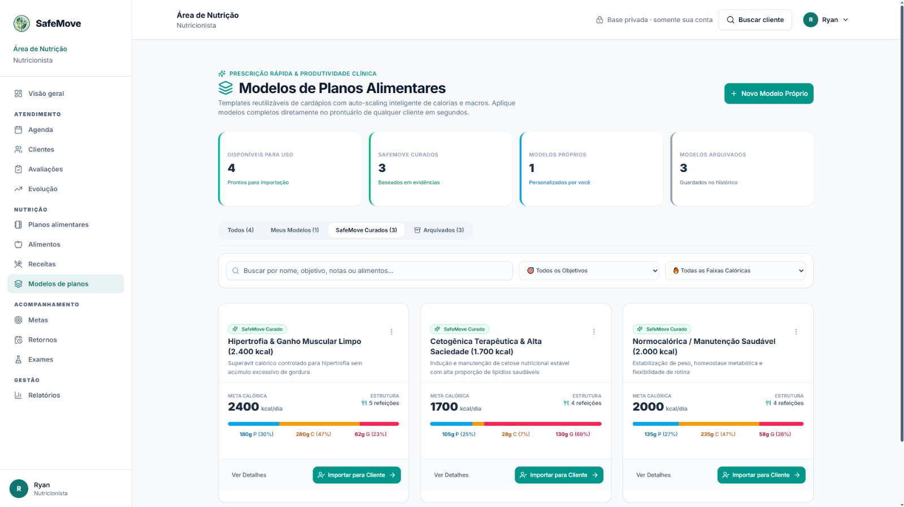
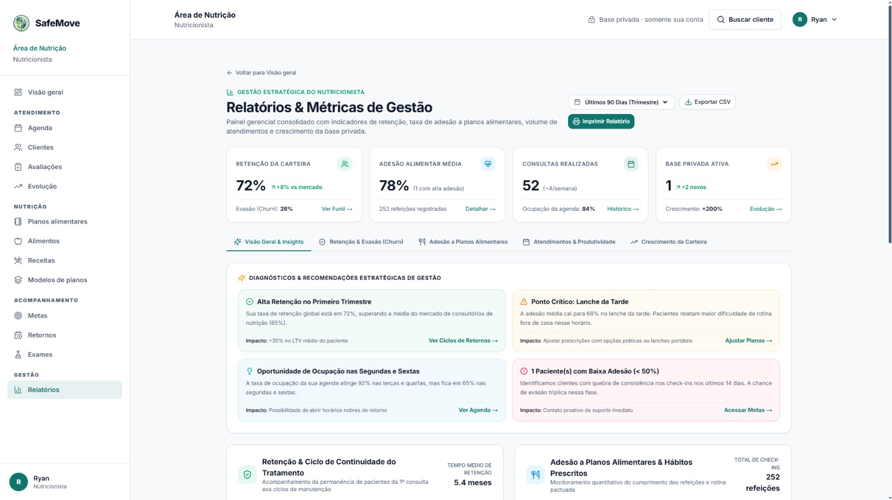
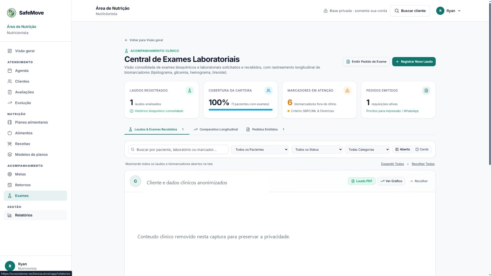

# SafeMove

**Gestão profissional de saúde e movimento, em um só lugar.**

O SafeMove é uma plataforma para **nutricionistas, personal trainers e
fisioterapeutas** organizarem seus clientes, atendimentos e acompanhamentos.
Cada profissional trabalha em um espaço próprio, com uma base privada de
prontuários e ferramentas alinhadas à sua atuação.

[Acessar a aplicação](https://ecossistema-resiliencia.vercel.app/) ·
[Reportar um problema](https://github.com/Gustavo13Cs/ecossistema-resiliencia/issues)

## Visão do produto

O trabalho de acompanhamento costuma ficar dividido entre agendas, planilhas,
prescrições e anotações. O SafeMove aproxima essas tarefas do prontuário do
cliente: o profissional encontra o histórico relevante e segue seu fluxo de
trabalho sem misturar dados de outras contas.

O produto é **professional-first**: cada conta escolhe uma atuação profissional
e recebe uma experiência adequada a ela. A fundação de gestão de clientes e
isolamento por profissional já está implementada; os módulos clínicos continuam
evoluindo para se integrar por completo a essa base.

## O produto em imagens

As capturas abaixo mostram áreas atuais da aplicação. A captura de exames foi
anonimizada para esta documentação.

<p align="center">
  
  
</p>
<p align="center"><sub><b>Agenda profissional</b> · <b>Plano alimentar e análise nutricional</b></sub></p>

<p align="center">
  
  
</p>
<p align="center"><sub><b>Modelos de planos alimentares</b> · <b>Relatórios e métricas de gestão</b></sub></p>

<p align="center">
  
</p>
<p align="center"><sub><b>Acompanhamento de exames laboratoriais</b></sub></p>

## Funcionalidades

- **Clientes e prontuários:** cadastro, consulta, edição, arquivamento e
  restauração de clientes em uma base privada por profissional.
- **Agenda e atendimentos:** visualizações de calendário, filtros e gestão de
  compromissos vinculados a clientes.
- **Nutrição:** planos alimentares, cálculo de energia e macronutrientes, banco
  de alimentos, receitas versionadas e modelos reutilizáveis de planos.
- **Treinamento:** organização de planos de treino, exercícios e registros de
  acompanhamento.
- **Fisioterapia:** avaliações e planos de reabilitação organizados por etapas.
- **Acompanhamento profissional:** avaliações físicas, exames laboratoriais,
  metas, retornos, evolução e relatórios de gestão.
- **Rotina clínica:** anamneses, suplementação, notas de consulta, consentimentos
  e registros de refeições e treinos.

Os módulos estão em diferentes estágios de maturidade. A migração para uma
experiência totalmente centrada no prontuário `Client` continua em andamento;
consulte o código e a documentação do módulo antes de depender de um fluxo
específico.

## Tecnologias

| Camada | Tecnologias |
| --- | --- |
| Aplicação web | Next.js 16, React 19, TypeScript |
| Interface | Tailwind CSS 4, Radix UI, React Hook Form, Zod |
| Estado e dados | TanStack Query, Context API |
| API | NestJS 11, TypeScript, class-validator |
| Persistência | Prisma 7, PostgreSQL 16 |
| Autenticação | JWT em cookies HttpOnly, Passport |
| Testes | Vitest, Jest e Cypress |

## Estrutura do repositório

```text
.
├── api/                              # Backend NestJS e persistência
│   ├── src/
│   │   ├── main.ts                   # Bootstrap, CORS e validação global
│   │   ├── app.module.ts             # Módulo raiz da API
│   │   ├── common/
│   │   │   ├── decorators/           # Rotas públicas e papéis
│   │   │   ├── guards/               # Autenticação e autorização
│   │   │   ├── client-access/         # Acesso ao prontuário Client
│   │   │   ├── patient-access/        # Compatibilidade com fluxos legados
│   │   │   ├── policies/              # Regras de domínio profissional
│   │   │   ├── security/              # Proteções compartilhadas
│   │   │   ├── strategies/            # Estratégias Passport/JWT
│   │   │   └── types/                 # Tipos compartilhados da API
│   │   ├── infra/
│   │   │   └── database/              # PrismaService e módulo de banco
│   │   └── modules/                   # Domínios da aplicação
│   │       ├── agenda/                # Tarefas e ocorrências recorrentes
│   │       ├── alerts/                # Alertas e tarefas agendadas
│   │       ├── anamneses/             # Fichas de anamnese
│   │       ├── appointments/          # Atendimentos e compromissos
│   │       ├── assessments/           # Avaliações físicas
│   │       ├── auth/                  # Cadastro, login e sessão
│   │       ├── clients/               # Prontuários e ciclo de vida
│   │       ├── consultation-notes/    # Notas de consulta
│   │       ├── consents/              # Consentimentos
│   │       ├── diet-plans/            # Planos alimentares e modelos
│   │       ├── foods/                 # Alimentos e dados nutricionais
│   │       ├── health-check-ins/      # Check-ins de saúde
│   │       ├── lab-exams/             # Exames e marcadores laboratoriais
│   │       ├── meal-logs/             # Registros de refeições
│   │       ├── metrics/               # Métricas e cálculos
│   │       ├── physio-assessments/    # Avaliações fisioterapêuticas
│   │       ├── recipes/               # Receitas privadas e versionadas
│   │       ├── rehab-plans/           # Planos e sessões de reabilitação
│   │       ├── supplements/           # Prescrições de suplementos
│   │       ├── users/                 # Perfis profissionais
│   │       ├── workout-logs/          # Registros de treino
│   │       └── workouts/              # Planos de treinamento
│   ├── prisma/
│   │   ├── migrations/                # Histórico versionado do banco
│   │   ├── schema.prisma              # Modelos e relações
│   │   ├── seed.ts                    # Seed de desenvolvimento
│   │   └── seed-phase1-e2e.ts         # Seed restrito aos testes E2E
│   ├── test/                          # Testes de integração/E2E da API
│   ├── .env.example                   # Modelo de configuração local
│   └── package.json                   # Scripts e dependências da API
├── web/                               # Frontend Next.js
│   ├── app/                           # Rotas e páginas (App Router)
│   │   ├── auth/                      # Login e cadastro profissional
│   │   ├── clientes/
│   │   │   ├── novo/                  # Cadastro de cliente
│   │   │   └── [id]/                  # Prontuário e ações do cliente
│   │   │       ├── exames/
│   │   │       ├── nova-anamnese/
│   │   │       ├── nova-dieta/
│   │   │       ├── nova-reabilitacao/
│   │   │       ├── nova-suplementacao/
│   │   │       ├── novo-treino/
│   │   │       ├── calculo-energetico/
│   │   │       └── visao-360/
│   │   ├── agenda/
│   │   ├── alimentos/
│   │   ├── avaliacoes/
│   │   ├── dietas/
│   │   ├── evolucao/
│   │   ├── exames/
│   │   ├── home/
│   │   ├── metas/
│   │   ├── modelos-planos/
│   │   ├── reabilitacao/
│   │   ├── receitas/
│   │   ├── relatorios/
│   │   ├── retornos/
│   │   └── treinos/
│   ├── components/
│   │   ├── auth/                      # Limites e proteção de rotas
│   │   ├── dashboard/                 # Painéis profissionais
│   │   ├── design/                    # Contratos e direção visual
│   │   ├── features/                  # Componentes por domínio
│   │   │   ├── agenda/                # Agenda e progresso
│   │   │   ├── appointments/           # Calendários e atendimentos
│   │   │   ├── clients/                # Diretório e prontuários
│   │   │   ├── dashboard/              # Resumo profissional
│   │   │   ├── diet/                   # Planos e modelos alimentares
│   │   │   ├── evolution/              # Evolução do cliente
│   │   │   ├── follow-ups/             # Retornos e acompanhamento
│   │   │   ├── goals/                  # Metas e alertas
│   │   │   ├── lab-exams/              # Exames e marcadores
│   │   │   ├── management/             # Indicadores da carteira
│   │   │   ├── placeholder/            # Estados de funcionalidades futuras
│   │   │   └── recipes/                # Receitas e versões
│   │   ├── feedback/                  # Estados de carregamento e erro
│   │   ├── layout/                    # Estrutura, sidebar e navegação
│   │   ├── marketing/                 # Apresentação das áreas profissionais
│   │   ├── providers/                 # Providers globais
│   │   └── ui/                        # Primitivos de interface reutilizáveis
│   ├── contexts/                      # Contexto de autenticação
│   ├── hooks/
│   │   ├── core/                      # Hooks de perfil e infraestrutura
│   │   ├── features/                  # Hooks por domínio/funcionalidade
│   │   └── ui/                        # Hooks de interface
│   ├── lib/                           # API, cache, regras e utilitários
│   ├── types/                         # Tipos de domínio do frontend
│   ├── styles/                        # Estilos globais
│   ├── public/                        # Logos, ícones e arquivos estáticos
│   ├── scripts/                       # Verificações e utilitários
│   ├── test/                          # Setup dos testes unitários
│   ├── cypress/
│   │   ├── e2e/                       # Fluxos automatizados no navegador
│   │   ├── fixtures/                  # Dados de apoio aos testes
│   │   └── support/                   # Comandos e configuração E2E
│   ├── .env.example                   # Modelo de configuração local
│   └── package.json                   # Scripts e dependências da web
├── docs/
│   ├── agents/                        # Registros de trabalho dos agentes
│   ├── app/guides/                    # Guias da aplicação
│   ├── assets/readme/                 # Capturas usadas neste README
│   ├── runbooks/                      # Procedimentos operacionais
│   ├── superpowers/
│   │   ├── plans/                     # Planos de implementação
│   │   └── specs/                     # Especificações de funcionalidades
│   ├── ARCHITECTURE.md
│   ├── database-baseline.md
│   ├── DECISIONS.md
│   ├── SECURITY.md
│   └── TASKS.md
├── .github/workflows/                 # CI
├── scripts/                           # Scripts operacionais da raiz
├── docker-compose.yml                 # Serviços locais da API e web
├── docker-compose.test.yml            # PostgreSQL isolado para testes
├── Dockerfile                         # Imagem de produção da API
├── AGENTS.md                          # Orientações para agentes
└── PRODUCT.md                         # Visão, usuários e princípios do produto
```

Cada módulo NestJS costuma agrupar controller, service, DTOs e testes junto ao
domínio. Na web, `app/` organiza as rotas; `components/features/` e
`hooks/features/` reúnem a interface e os dados de cada funcionalidade.

## Executar localmente

### Pré-requisitos

- Node.js 22 ou compatível com Next.js 16 e NestJS 11
- npm
- PostgreSQL 16 acessível pela máquina
- Docker Compose, caso prefira executar a API e a web em containers

### Configurar as variáveis de ambiente

Na raiz do repositório, crie os arquivos locais a partir dos exemplos:

```powershell
Copy-Item api/.env.example api/.env
Copy-Item web/.env.example web/.env.local
```

Configure `api/.env` com as URLs válidas do PostgreSQL em `DATABASE_URL` e
`DIRECT_URL`, uma chave aleatória e forte em `JWT_SECRET` e as origens permitidas
em `ALLOWED_ORIGINS`. Em `web/.env.local`, configure
`NEXT_PUBLIC_API_URL=http://localhost:3000` para desenvolvimento local. Os
valores de Supabase no exemplo da web são opcionais quando a aplicação usa a API
NestJS.

Não versione `.env`, `.env.local` ou credenciais. Para configurar bancos remotos,
consulte [`docs/database-baseline.md`](docs/database-baseline.md) e não execute
procedimentos de reconciliação sem seguir esse guia.

### Iniciar API e web

Em um terminal:

```powershell
cd api
npm install
npx prisma migrate deploy
npm run start:dev
```

Em outro terminal:

```powershell
cd web
npm install
npm run dev
```

A web ficará disponível em `http://localhost:3001` e a API em
`http://localhost:3000`.

### Usar Docker Compose

Depois de configurar `api/.env` e `web/.env.local`, execute na raiz:

```powershell
docker compose up --build
```

O Compose inicia a API e a web; **não cria um serviço PostgreSQL**. O banco deve
estar disponível separadamente e ser acessível de dentro dos containers. Se o
banco estiver na máquina host, use um hostname acessível a partir do Docker em
vez de `localhost` nas URLs configuradas para a API.

## Testes e validações

```powershell
# API: testes unitários
cd api
npm test

# Web: testes unitários, tipos e lint
cd ..\web
npm test
npm run typecheck
npm run lint
```

Os testes E2E da API e da web dependem de serviços configurados; para a base
PostgreSQL isolada dos testes, consulte `docker-compose.test.yml` e as
instruções dos projetos em `api/` e `web/`.

## Privacidade e segurança

O backend protege rotas por autenticação e valida autorização e propriedade do
prontuário no servidor. A sessão usa JWT em cookie HttpOnly; dados clínicos não
devem ser persistidos no armazenamento local do navegador. Ocultar uma ação na
interface não substitui a autorização na API.

Leia [`docs/SECURITY.md`](docs/SECURITY.md) antes de alterar autenticação,
autorização ou dados clínicos. O SafeMove não declara certificação regulatória
ou conformidade clínica a partir da implementação técnica descrita neste
repositório.

## Documentação

- [Visão do produto](PRODUCT.md)
- [Arquitetura](docs/ARCHITECTURE.md)
- [Modelo de segurança](docs/SECURITY.md)
- [Tarefas e evolução](docs/TASKS.md)
- [Baseline e migrações do banco](docs/database-baseline.md)

## Contribuição

Contribuições e relatos de problemas são bem-vindos. Abra uma
[issue](https://github.com/Gustavo13Cs/ecossistema-resiliencia/issues) com o
contexto, comportamento esperado e passos para reproduzir, evitando incluir
informações pessoais ou dados clínicos.
