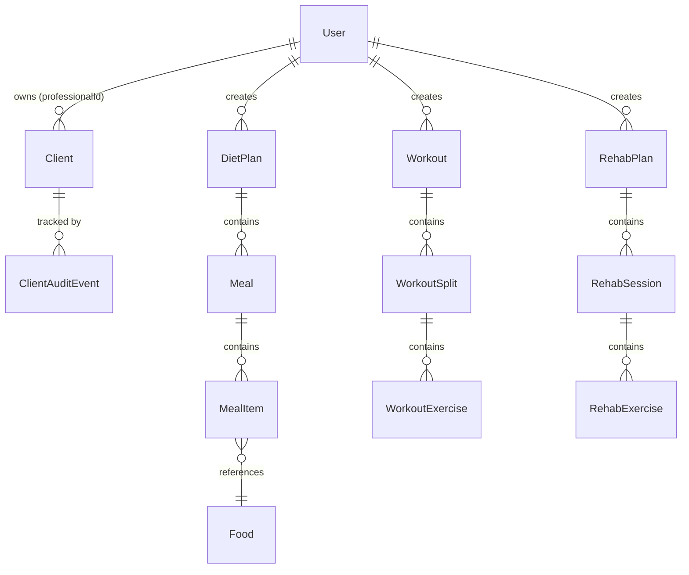

# Arquitetura — SafeMove (ecossistema-resiliencia)

> Última atualização: Setembro 2026

---

## 1. Visão de Camadas

```
┌──────────────────────────────────────────────────────────────────┐
│                        FRONTEND (web/)                          │
│  Next.js 16 (App Router) + React 19 + TypeScript                │
│  Tailwind CSS 4 + Radix UI + shadcn/ui patterns                 │
│  TanStack Query (estado de servidor) + Context API (auth)       │
└────────────────────────────┬─────────────────────────────────────┘
                             │ HTTP REST (JSON)
                             │ JWT em HttpOnly Cookie
┌────────────────────────────┴─────────────────────────────────────┐
│                        BACKEND (api/)                            │
│  NestJS 11 + TypeScript strict                                   │
│  Guards (JWT, Throttler, ClientAccess)                            │
│  class-validator + class-transformer                              │
│  ScheduleModule (alertas automáticos)                             │
└────────────────────────────┬─────────────────────────────────────┘
                             │ Prisma ORM 7.5
┌────────────────────────────┴─────────────────────────────────────┐
│                      DATABASE                                     │
│  PostgreSQL 16                                                    │
│  Schema relacional normalizado                                    │
│  Isolamento por professionalId (app-level)                        │
└──────────────────────────────────────────────────────────────────┘
```

---

## 2. Backend — Organização de Módulos

### Diretório `api/src/`

```
api/src/
├── main.ts                 # Bootstrap: CORS, cookies, validação global
├── app.module.ts           # Módulo raiz — imports de todos os feature modules
├── common/
│   ├── guards/             # JwtAuthGuard, ThrottlerGuard
│   ├── decorators/         # @Public(), @Roles(), @CurrentUser()
│   ├── strategies/         # JwtStrategy (Passport)
│   ├── client-access/      # ClientAccessGuard — verifica ownership de Client
│   ├── patient-access/     # PatientAccessGuard — legado, para ProfessionalPatientLink
│   └── types/              # Tipos compartilhados
├── infra/
│   └── database/
│       ├── prisma.service.ts   # PrismaClient singleton com lifecycle hooks
│       └── database.module.ts  # @Global() — exporta PrismaService
└── modules/
    ├── auth/               # POST /auth/login, POST /auth/register, GET /auth/me
    ├── users/              # CRUD de perfis profissionais
    ├── clients/            # CRUD + archive/restore de Client
    ├── workouts/           # Planos de treino (Workout → Split → Exercise)
    ├── diet-plans/         # Planos dietéticos (DietPlan → Meal → MealItem)
    ├── foods/              # Banco de alimentos (busca, CRUD)
    ├── assessments/        # Avaliações físicas (antropometria)
    ├── physio-assessments/ # Avaliações fisioterapêuticas
    ├── rehab-plans/        # Planos de reabilitação (RehabPlan → Session → Exercise)
    ├── anamneses/          # Fichas de anamnese
    ├── supplements/        # Planos de suplementação
    ├── lab-exams/          # Exames laboratoriais + marcadores
    ├── alerts/             # Alertas automáticos (inatividade, platô, overtraining)
    ├── metrics/            # Cálculos metabólicos (TMB, GET)
    ├── agenda/             # Agenda diária (tasks + occurrences)
    ├── consultation-notes/ # Notas de consulta
    ├── consents/           # Consentimentos de paciente
    ├── health-check-ins/   # Check-ins de saúde
    ├── meal-logs/          # Logs de refeição
    └── workout-logs/       # Logs de treino
```

### Padrão por Módulo

Cada módulo segue a mesma estrutura:

```
modules/<nome>/
├── <nome>.module.ts        # @Module — imports, controllers, providers
├── <nome>.controller.ts    # Endpoints REST
├── <nome>.service.ts       # Lógica de negócio + queries Prisma
└── dto/
    ├── create-<nome>.dto.ts
    └── update-<nome>.dto.ts
```

### Autenticação & Autorização

1. **JWT + Passport**: `JwtStrategy` valida o token do cookie `access_token`
2. **JwtAuthGuard** (global): protege todas as rotas; rotas públicas usam `@Public()`
3. **ClientAccessGuard**: verifica que o `Client` pertence ao `req.user.id`
4. **ThrottlerGuard** (global): 20 req/min por IP
5. **Isolamento**: todo query que toca `Client` filtra por `professionalId = req.user.id`

---

## 3. Frontend — Organização

### Diretório `web/`

```
web/
├── app/                      # App Router (Next.js)
│   ├── layout.tsx            # Root layout + providers
│   ├── page.tsx              # Landing page / redirect
│   ├── globals.css           # Tailwind imports
│   ├── auth/                 # /auth/login, /auth/register
│   ├── home/                 # Dashboard principal
│   ├── clientes/             # Gestão de clientes
│   ├── dietas/               # Módulo nutrição
│   ├── treinos/              # Módulo treino
│   ├── reabilitacao/         # Módulo fisioterapia
│   ├── avaliacoes/           # Avaliações
│   └── alimentos/            # Banco de alimentos
│
├── components/
│   ├── ui/                   # 57 primitivos (Button, Dialog, Table, etc.)
│   ├── features/             # Componentes de domínio
│   │   ├── agenda/
│   │   ├── clients/
│   │   └── diet/
│   ├── dashboard/            # PainelUTI, etc.
│   └── providers/            # QueryProvider, ThemeProvider
│
├── hooks/
│   ├── core/                 # useProfile, usePacienteDashboard
│   └── features/             # useClients, useAgenda, useLabExams, etc.
│
├── contexts/
│   └── auth-context.tsx      # AuthProvider (JWT, login, logout, user state)
│
├── lib/
│   ├── api.ts                # Axios instance com interceptors
│   ├── query-client.ts       # TanStack Query config
│   ├── query-keys.ts         # Chaves de cache centralizadas
│   ├── query-invalidation.ts # Helpers de invalidação
│   └── utils.ts              # cn(), formatters
│
├── types/
│   ├── client.ts             # Tipos de Client
│   └── agenda.ts             # Tipos de Agenda
│
├── cypress/                  # Testes E2E
└── scripts/                  # Scripts utilitários
```

### Padrões do Frontend

1. **Data fetching**: TanStack Query com hooks em `hooks/features/`
2. **Cache keys**: centralizadas em `lib/query-keys.ts`
3. **Componentes**: UI pura em `components/ui/`, lógica de negócio em `components/features/`
4. **Forms**: React Hook Form + Zod para validação
5. **Estilos**: Tailwind CSS 4 utility classes, CSS variables para tokens do tema

---

## 4. Banco de Dados — Modelo Simplificado



### Entidades Principais

| Modelo            | Propósito                               | Pertence a        |
|-------------------|-----------------------------------------|--------------------|
| `User`            | Identidade autenticável (profissional)  | —                  |
| `Client`          | Prontuário sem login                    | `User` (owner)     |
| `DietPlan`        | Prescrição nutricional                  | `User` (creator)   |
| `Workout`         | Plano de treino                         | `User` (creator)   |
| `RehabPlan`       | Plano de reabilitação                   | `User` (creator)   |
| `PhysioAssessment`| Avaliação fisioterapêutica              | `User` (patient)   |
| `Anamnesis`       | Ficha clínica completa                  | `User` (patient)   |
| `LabExam`         | Exame laboratorial                      | `User` (patient)   |
| `AgendaTask`      | Tarefa na agenda diária                 | `User` (both)      |

---

## 5. Infraestrutura

### Docker

| Arquivo                    | Propósito                              |
|---------------------------|----------------------------------------|
| `Dockerfile`              | Build da API (NestJS)                  |
| `docker-compose.yml`      | Dev: API + Web + DB (porta 3000/3001)  |
| `docker-compose.test.yml` | Testes: DB isolado (porta 5434)        |

### CI/CD

O workflow `.github/workflows/ci.yml` roda em push/PR para `main`:

1. **api-unit** — Testes unitários da API (sem banco)
2. **api-e2e** — Testes e2e com banco de teste isolado
3. **web-typecheck** — Verificação TypeScript do frontend
4. **web-cypress** — Testes Cypress (depende dos 3 anteriores)

### Deploy

- **Frontend**: Vercel (https://ecossistema-resiliencia.vercel.app/)
- **API + DB**: Configurado via Docker Compose

---

## 6. Convenções para Novos Módulos

### Adicionando um novo módulo na API:

1. Criar pasta em `api/src/modules/<nome>/`
2. Criar `<nome>.module.ts`, `<nome>.controller.ts`, `<nome>.service.ts`
3. Adicionar DTOs em `dto/`
4. Registrar no `app.module.ts`
5. Proteger com `JwtAuthGuard` (já é global) + `ClientAccessGuard` se toca `Client`

### Adicionando uma nova rota no frontend:

1. Criar pasta em `web/app/<rota>/`
2. Criar `page.tsx` com o componente da página
3. Se precisa de dados: criar hook em `web/hooks/features/`
4. Adicionar query key em `web/lib/query-keys.ts`
5. Adicionar na navegação do `Sidebar.tsx`
