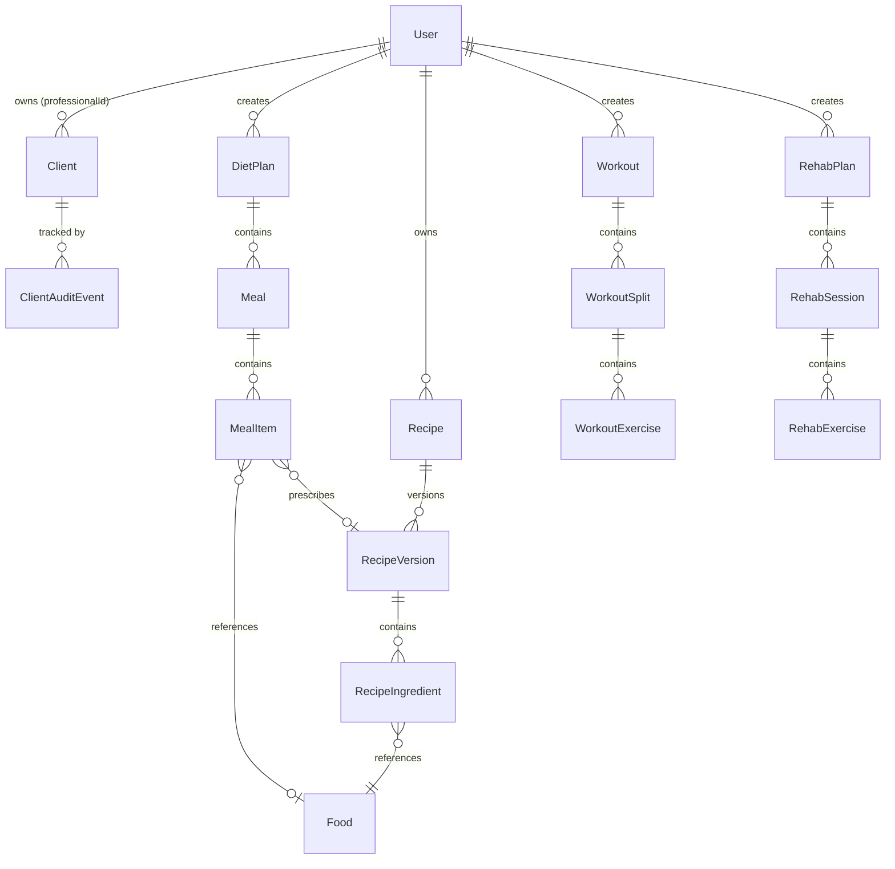

# Arquitetura — SafeMove (ecossistema-resiliencia)

> Última atualização: 2 de outubro de 2026

---

## 1. Visão de Camadas

```
┌──────────────────────────────────────────────────────────────────┐
│                        FRONTEND (web/)                          │
│  Next.js 16 (App Router) + React 19 + TypeScript                │
│  Tailwind CSS 4 + Radix UI + shadcn/ui patterns                 │
│  TanStack Query (estado de servidor) + Context API (auth)       │
└────────────────────────────┬─────────────────────────────────────┘
                             │ HTTP REST (JSON)
                             │ JWT em HttpOnly Cookie
┌────────────────────────────┴─────────────────────────────────────┐
│                        BACKEND (api/)                            │
│  NestJS 11 + TypeScript strict                                   │
│  Guards (JWT, Throttler, Roles) + ClientAccessService                            │
│  class-validator + class-transformer                              │
│  ScheduleModule (alertas automáticos)                             │
└────────────────────────────┬─────────────────────────────────────┘
                             │ Prisma ORM 7.10
┌────────────────────────────┴─────────────────────────────────────┐
│                      DATABASE                                     │
│  PostgreSQL 16                                                    │
│  Schema relacional normalizado                                    │
│  Isolamento por professionalId (app-level)                        │
└──────────────────────────────────────────────────────────────────┘
```

---

## 2. Backend — Organização de Módulos

### Diretório `api/src/`

```
api/src/
├── main.ts                 # Bootstrap: CORS, cookies, validação global
├── app.module.ts           # Módulo raiz — imports de todos os feature modules
├── common/
│   ├── guards/             # JwtAuthGuard, ThrottlerGuard
│   ├── decorators/         # @Public(), @Roles(), @CurrentUser()
│   ├── strategies/         # JwtStrategy (Passport)
│   ├── client-access/      # ClientAccessService — verifica ownership de Client
│   └── types/              # Tipos compartilhados
├── infra/
│   └── database/
│       ├── prisma.service.ts   # PrismaClient singleton com lifecycle hooks
│       └── database.module.ts  # @Global() — exporta PrismaService
└── modules/
    ├── auth/               # Login, registro, me, csrf, refresh e logout; sessões revogáveis
    ├── users/              # Perfil próprio e overview por Client
    ├── clients/            # CRUD + archive/restore de Client
    ├── workouts/           # Planos de treino (Workout → Split → Exercise)
    ├── diet-plans/         # Planos dietéticos (DietPlan → Meal → MealItem)
    ├── foods/              # Banco de alimentos (busca, CRUD)
    ├── recipes/            # Biblioteca privada, nutrientes por porção e versões imutáveis
    ├── assessments/        # Avaliações físicas (antropometria)
    ├── physio-assessments/ # Avaliações fisioterapêuticas
    ├── rehab-plans/        # Planos de reabilitação (RehabPlan → Session → Exercise)
    ├── anamneses/          # Fichas de anamnese
    ├── supplements/        # Planos de suplementação
    ├── lab-exams/          # Exames laboratoriais + marcadores
    ├── alerts/             # Alertas automáticos (inatividade, platô, overtraining)
    ├── client-goals/       # Metas e hábitos persistidos por Client
    ├── appointments/       # Agenda profissional vinculada a Client
    ├── consultation-notes/ # Notas de consulta
    ├── lab-orders/         # Pedidos laboratoriais persistidos por Client
```

### Padrão por Módulo

Cada módulo segue a mesma estrutura:

```
modules/<nome>/
├── <nome>.module.ts        # @Module — imports, controllers, providers
├── <nome>.controller.ts    # Endpoints REST
├── <nome>.service.ts       # Lógica de negócio + queries Prisma
└── dto/
    ├── create-<nome>.dto.ts
    └── update-<nome>.dto.ts
```

### Autenticação & Autorização

1. `JwtStrategy` valida access JWT de 15 minutos e consulta a sessão e identidade atuais no banco. Refresh opaco rotativo tem validade fixa de 30 dias; apenas seu hash é persistido.
2. `JwtAuthGuard` global exige autenticação por padrão. `@Public()` delimita health checks e rotas de autenticação, sem remover throttling.
3. `ThrottlerGuard` limita 60 requisições/minuto por IP; login limita 5/minuto. Guards de papel restringem cada domínio.
4. `ClientAccessService` e queries com `professionalId = req.user.sub` verificam ownership. Nenhum papel contorna esse filtro; recursos alheios retornam 404.
5. Mutações por cookie exigem origem permitida e par CSRF. O proxy Next.js `/api` mantém a sessão same-origin; o refresh cookie usa `/api/auth`.

Os módulos de agenda diária antiga, métricas de paciente, consentimentos, check-ins e logs de paciente permanecem no histórico do código/schema, mas não estão montados. A agenda profissional usa `AppointmentsModule`.

---
## 3. Frontend — Organização

### Diretório `web/`

```
web/
├── app/                      # App Router (Next.js)
│   ├── layout.tsx            # Root layout + providers
│   ├── page.tsx              # Landing page / redirect
│   ├── globals.css           # Tailwind imports
│   ├── auth/                 # /auth/login, /auth/register
│   ├── home/                 # Dashboard principal
│   ├── clientes/             # Gestão de clientes
│   ├── dietas/               # Módulo nutrição
│   ├── treinos/              # Módulo treino
│   ├── reabilitacao/         # Módulo fisioterapia
│   ├── avaliacoes/           # Avaliações
│   ├── alimentos/            # Banco de alimentos
│   └── receitas/             # Banco privado de receitas versionadas
│
├── components/
│   ├── ui/                   # 57 primitivos (Button, Dialog, Table, etc.)
│   ├── features/             # Componentes de domínio
│   │   ├── agenda/
│   │   ├── clients/
│   │   └── diet/
│   ├── dashboard/            # PainelUTI, etc.
│   └── providers/            # QueryProvider, ThemeProvider
│
├── hooks/
│   ├── core/                 # useProfile, usePacienteDashboard
│   └── features/             # useClients, useAppointments, useLabExams, etc.
│
├── contexts/
│   └── auth-context.tsx      # AuthProvider (sessão, login, logout e limpeza de caches)
│
├── lib/
│   ├── api.ts                # Axios, bootstrap CSRF e renovação única concorrente
│   ├── query-client.ts       # TanStack Query config
│   ├── query-keys.ts         # Chaves de cache centralizadas por sessão e Client
│   ├── query-invalidation.ts # Helpers de invalidação
│   └── utils.ts              # cn(), formatters
│
├── types/
│   ├── client.ts             # Tipos de Client
│   └── appointment.ts        # Tipos da agenda profissional
│
├── cypress/                  # Testes E2E
└── scripts/                  # Scripts utilitários
```

### Padrões do Frontend

1. **Data fetching**: TanStack Query com hooks em `hooks/features/`
2. **Cache keys**: centralizadas em `lib/query-keys.ts`
3. **Componentes**: UI pura em `components/ui/`, lógica de negócio em `components/features/`
4. **Forms**: React Hook Form + Zod para validação
5. **Estilos**: Tailwind CSS 4 utility classes, CSS variables para tokens do tema

---

## 4. Banco de Dados — Modelo Simplificado


```mermaid
erDiagram
    User ||--o{ Client : "owns (professionalId)"
    User ||--o{ DietPlan : "creates"
    User ||--o{ Workout : "creates"
    User ||--o{ RehabPlan : "creates"
    Client ||--o{ ClientAuditEvent : "tracked by"
    DietPlan ||--o{ Meal : contains
    Meal ||--o{ MealItem : contains
    MealItem }o--o| Food : references
    MealItem }o--o| RecipeVersion : prescribes
    User ||--o{ Recipe : owns
    Recipe ||--o{ RecipeVersion : versions
    RecipeVersion ||--o{ RecipeIngredient : contains
    RecipeIngredient }o--|| Food : references
    Workout ||--o{ WorkoutSplit : contains
    WorkoutSplit ||--o{ WorkoutExercise : contains
    RehabPlan ||--o{ RehabSession : contains
    RehabSession ||--o{ RehabExercise : contains
```

### Entidades Principais

| Modelo            | Propósito                               | Pertence a        |
|-------------------|-----------------------------------------|--------------------|
| `User`            | Identidade autenticável (profissional)  | —                  |
| `Client`          | Prontuário sem login                    | `User` (owner)     |
| `DietPlan`        | Prescrição nutricional                  | `Client` + `User` (creator) |
| `Recipe`          | Identidade privada e estado da receita | `User` (owner)     |
| `RecipeVersion`   | Conteúdo e nutrientes por porção imutáveis | `Recipe`       |
| `RecipeIngredient`| Alimento e quantidade da versão        | `RecipeVersion`    |
| `Workout`         | Plano de treino                         | `Client` + `User` (creator) |
| `RehabPlan`       | Plano de reabilitação                   | `Client` + `User` (creator) |
| `PhysioAssessment`| Avaliação fisioterapêutica              | `Client` + autor profissional |
| `Anamnesis`       | Ficha clínica completa                  | `Client` + autor profissional |
| `LabExam`         | Exame laboratorial                      | `Client` + autor profissional |
| `Appointment` | Agenda profissional | `Client` + profissional |
| `ClientGoal` | Metas e hábitos | `Client` + profissional |
| `LabOrder` | Pedido laboratorial | `Client` + profissional |
| `AuthSession` | Sessão revogável e hash de refresh | `User` |
| `PatientAlert` | Snapshot de alertas de treino | `Client` + profissional; Patient histórico |

`MealItem` referencia exatamente um alimento ou uma versão de receita (constraint
XOR). Na receita, a quantidade do item representa porções. O cálculo nutricional
usa `Food` persistido no backend; a edição publica uma nova versão e os planos
existentes mantêm a versão prescrita até atualização explícita no editor.
Templates, impressão e lista de compras preservam essa referência. As novas
tabelas usam o RLS defensivo da Data API; o isolamento entre profissionais
continua sendo aplicado nos services NestJS.

---

## 5. Infraestrutura

### Docker

| Arquivo                    | Propósito                              |
|---------------------------|----------------------------------------|
| `Dockerfile` | Targets API production (sem ferramentas dev) e migration (Prisma CLI) |
| `docker-compose.runtime.yml` | API/web de runtime e job separado de migrations; banco externo |
| `docker-compose.test.yml` | Testes: DB isolado (porta 5434)        |

A web usa `.next/standalone`, assets estáticos e usuário não-root. A API final contém somente JavaScript compilado e dependências de produção. Migrations executam em job separado antes da API. O Compose runtime não monta fontes nem usa `env_file` das aplicações; exige configuração explícita e HTTPS por proxy. O Compose antigo permanece histórico e não é compatível com essas imagens.

O CSP recebe nonce por requisição no proxy e no layout raiz assíncrono; todas as páginas são dinâmicas. Impressões usam escaping compartilhado e não executam scripts inline. Dados clínicos usam cache apenas em memória, sem persistência no navegador.

### CI/CD

O workflow `.github/workflows/ci.yml` roda em push/PR para `main`:

1. **api-unit** — Testes unitários da API (sem banco)
2. **api-e2e** — Testes e2e com banco de teste isolado
3. **web-typecheck** — Verificação TypeScript do frontend
4. **web-cypress** — Testes Cypress (depende dos 3 anteriores)

### Deploy

- **Frontend**: Vercel (https://ecossistema-resiliencia.vercel.app/)
- **API/web em containers**: `docker-compose.runtime.yml`, com banco externo aprovado e HTTPS por proxy. Consulte o runbook antes de publicar.

---

## 6. Convenções para Novos Módulos

### Adicionando um novo módulo na API:

1. Criar pasta em `api/src/modules/<nome>/`
2. Criar `<nome>.module.ts`, `<nome>.controller.ts`, `<nome>.service.ts`
3. Adicionar DTOs em `dto/`
4. Registrar no `app.module.ts`
5. Preservar o `JwtAuthGuard` global, aplicar papel do domínio e verificar ownership com `ClientAccessService`/queries se toca `Client`

### Adicionando uma nova rota no frontend:

1. Criar pasta em `web/app/<rota>/`
2. Criar `page.tsx` com o componente da página
3. Se precisa de dados: criar hook em `web/hooks/features/`
4. Adicionar query key em `web/lib/query-keys.ts`
5. Adicionar na navegação do `Sidebar.tsx`
